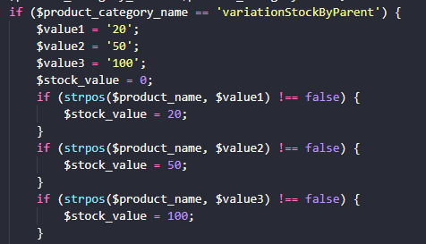
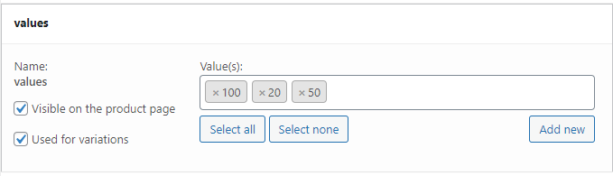
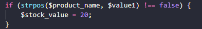

<h1>WooCommerce Variation stock based on parent stock</h1>

This function causes the stock of product variations to be based on the stock of the parent product according to the stock value that a variation represents for example: a variation that represents 20 products will remove 20 units from the parent's stock and the stock of this same variance will be the parent product's total inventory value divided by 20.

<h2>Sumary</h2>

<ul>
  <li><a href="#howToUse">How to use this in your project</a></li>
  <ul>
    <li><a href="#product_category_name">$product_category_name</a></li>
    <li><a href="#values">$value1, $value2, $value3, ...</a></li>
    <li><a href="#stock_value">$stock_value</a></li>
    <li><a href="#wordpress">In your Wordpress admin page:</a></li>
  </ul>
  <li><a href="#howItWorks">How it works?</a></li>
</ul>

<h2 id="howToUse">How to use this in your project</h2>

First copy and paste the code above into your theme's functions.php file, then it will be necessary to change some values in the code.

<h3 id="product_category_name">$product_category_name</h3>

This variable is the name of a category inserted in the parent product, it can be anything you want, its function is to make only some products on your wordpress site be affected and not all existing variable products.

<h3 id="values">$value1, $value2, $value3, ...</h3>

This variable is a string with the values it has in the name of the attributes of the variations, maybe with this image it will be clearer:

The values attribute has the following values:

<ul>
  <li>20</li> 
  <li>50</li>
  <li>100</li> 
</ul>

in this case you can create 3 $value variables ($value1, $value2, $value3) each with one of these values example:

<ul>
  <li>$value1 = "20";</li> 
  <li>$value2 = "50";</li>
  <li>$value3 = "100";</li> 
</ul>

<h3 id="stock_value">$stock_value</h3>

This variable is the stock value represented by a variation.

For example if the amount of stock represented by $value1 is equal to 20 you must have a variable $stock_value with a value of 20.Exemple:

<h3 id="wordpress">In your Wordpress admin page:</h3>

steps to be taken in creating the product:

<ul>
  <li>the product must be of the variable type</li> 
  <li>add the category to product</li>
  <li>add the attributes</li> 
  <li>create variations for the products</li> 
  <li>enable inventory management on variations</li>
  <li>enable inventory management on parent product</li>
  <li>add an inventory value in the parent product</li>
  <li>publish or update the product</li>
</ul>

<h2 id="howItWorks">How it works?</h2>
